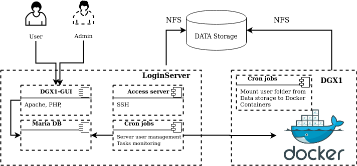
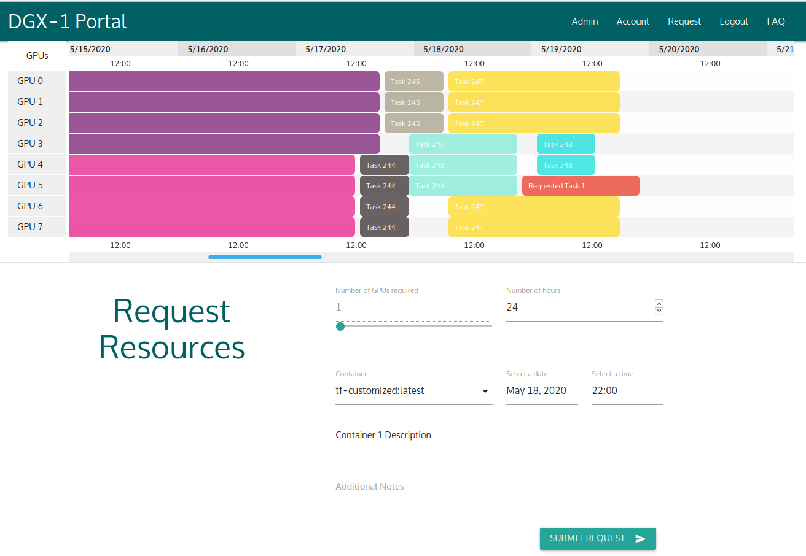

# DGX1-scheduler
Web-based multi-user concurrent job scheduling system on the shared computing resource objects
 

  

   

Here we propose a user-friendly jobs and resources allocation manager for the ML server. 
We introduce some unique features of the designed system such as a protection of user's sensitive data, automatic cleaning of unused information, secure of the host OS via environment virtualization (container), and direct access to the container via SSH. 
   
  Proposed web-based tool allows users to request and allocate resources on a server and monitor the progress of their tasks. It is created to simplify access to servers particularly ML servers, to allocate computational resources while satisfying data security concerns. The proposed tool also relieves system administrators form manually allocating resources to users and monitor the progress. The tool is user friendly and transparent so that the system administrator and the user can simply view all jobs in progress to find the best allocation for their tasks. 

  

 
Please refer to the instructions in howto.txt file to deploy the job-scheduler.

 
